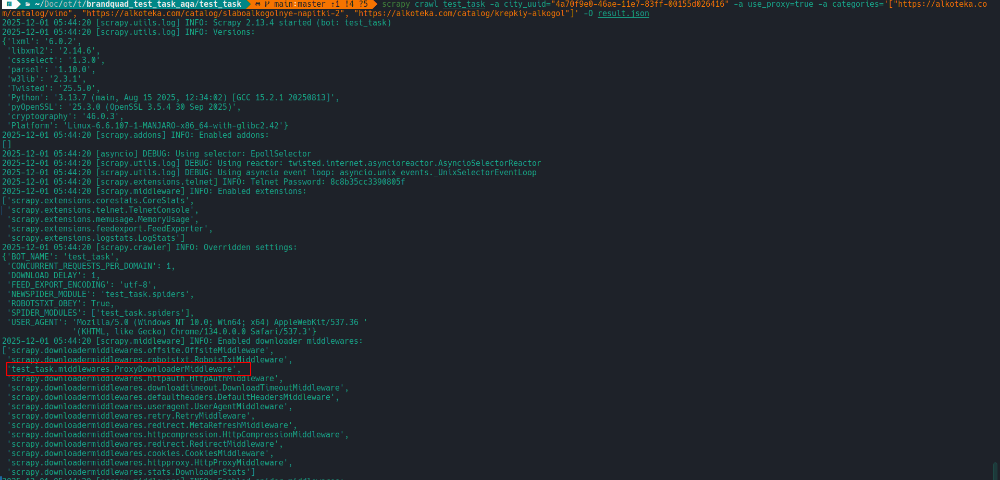
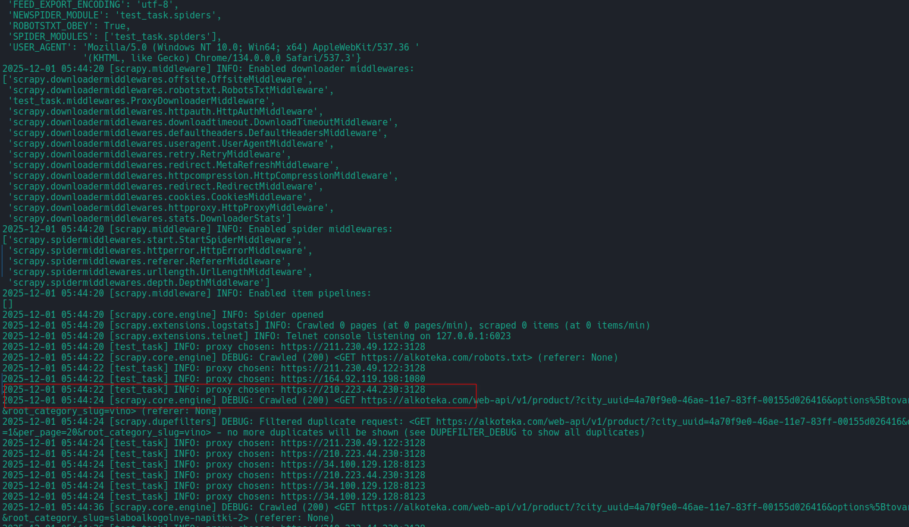
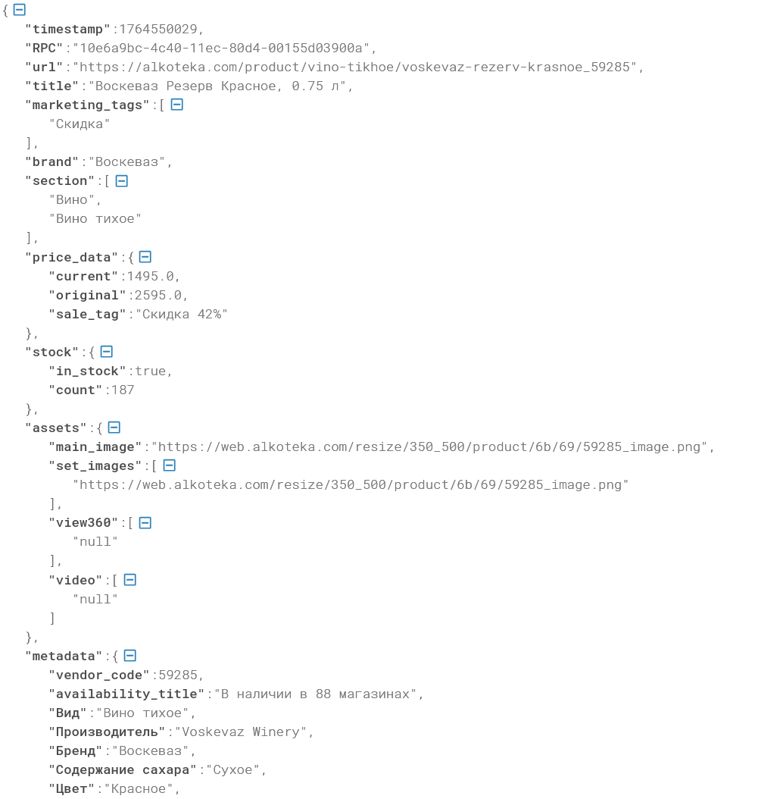
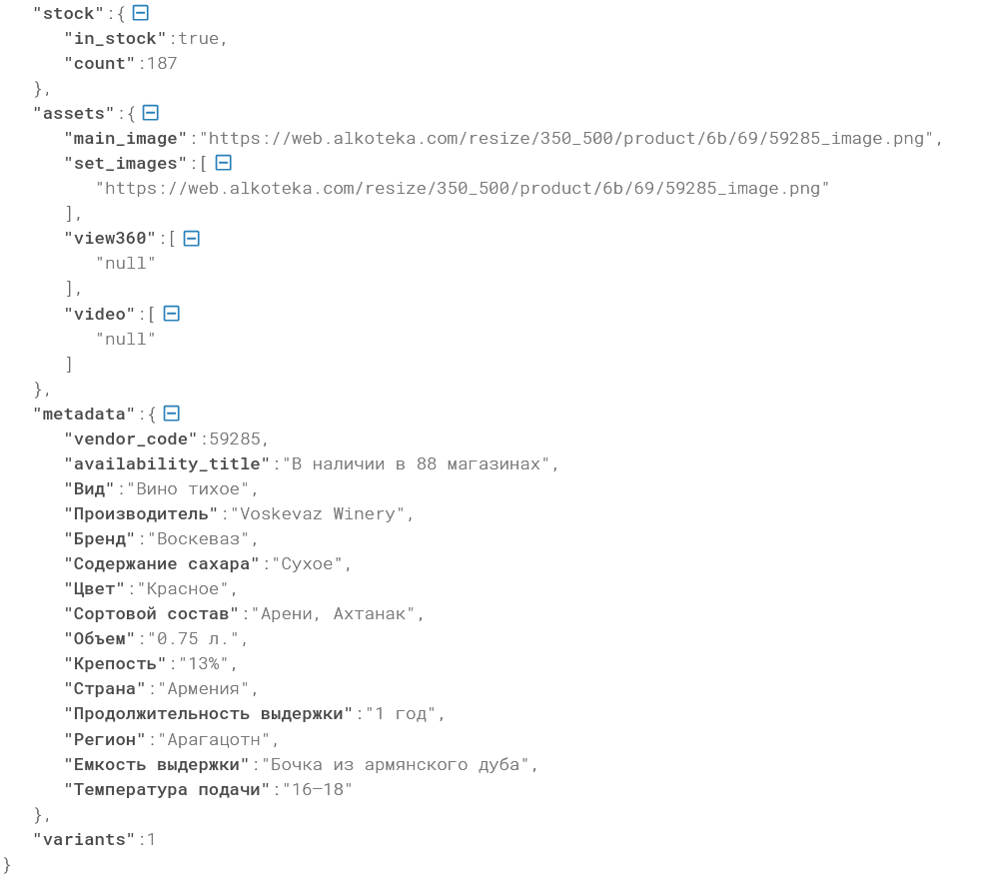
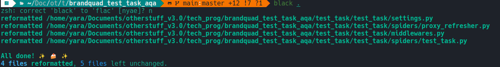

# task_crawler
## Примеры использования каждой из 3 опций по отдельности:
### Задать категории парсинга:
```scrapy crawl test_task -a categories='["https://alkoteka.com/catalog/vino", "https://alkoteka.com/catalog/slaboalkogolnye-napitki-2", "https://alkoteka.com/catalog/krepkiy-alkogol"]' -O result.json```
### Использовать прокси:
Все прокси хранятся в файле `proxy_list.txt`. Подключение осуществляется с помощью ProxyDownloaderMiddleware. Можно задать свои или использовать `scrapy crawl proxy_refresher` для подхвата бесплатных https-прокси с https://free-proxy-list.net/en/. \
<br>
```scrapy crawl test_task -a use_proxy=true```
### Задать другой регион при парсинге:
```scrapy crawl test_task -a city_uuid="4a70f9e0-46ae-11e7-83ff-00155d026416"```
<br>
Примеры uuid:
 - Краснодар - 4a70f9e0-46ae-11e7-83ff-00155d026416
 - Москва - 396df2b5-7b2b-11eb-80cd-00155d039009 \

Скриншоты работы паука:



Пример `result.json`:



Использованы форматтер Black и линтер Ruff:

